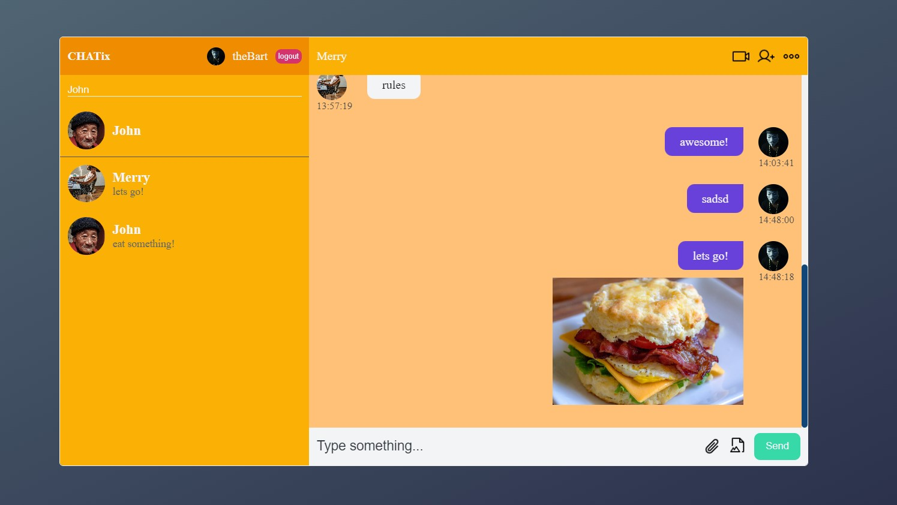

# Simple Chat App with Vite -> CHATix

This project was bootstrapped with [Vite].

## What is used in the project

- useRef, useEffect, useState, useReducer, context API
- react-router-dom
- Database -> Firebase
- User Authenticate Firebase
- Many function from Firestore Database
- SASS
- Open Props
- dotenv

## Available Scripts

In the project directory, you can run:

### `npm run dev`

- You will also need to add your own firebase configuration, set it up with your own data, or add an .env-local file where you put the correct data
